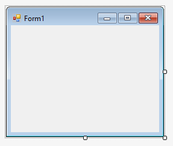
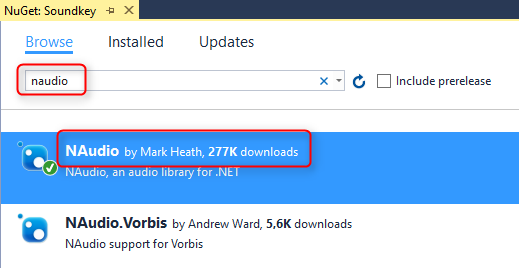

# Soundkey
Tutorial für ein Programm, das Töne abspielt, wenn eine Taste gedrückt wird.

## Der Programmieranfang

Dieses Tutorial sieht vor, dass das Programm in C# geschrieben wird. C# ist eine von vielen Programmiersprachen.

Um in C# zu programmieren verwenden wir einen kostenlosen Editor von Microsoft, nämlich [Visual Studio 2017 Community Edition](https://www.visualstudio.com/downloads). Um an eine kostenlose Lizenz zu kommen brauchst Du einen [Microsoft Live Account](https://login.live.com).

Ein neues Projekt kannst Du auf zwei Arten anlegen:

1. im Menü File / New / Project ...
2. auf der Startseite (sofern angezeigt): New Project ...

Im nächsten Schritt wirst Du mit einer großen Auswahl an Möglichkeiten konfrontiert. Hier gibt es vier Dinge zu erledigen:

1. die Programmiersprache Visual C#
2. ein Projekt mit grafischer Oberfläche vom Typ "Windows Forms Application"
3. einen Namen, den Du selbst auswählen kannst (am besten ohne Leerzeichen und ohne Umlaute)
4. den Ordner, in dem Du Dein Projekt speichern möchtest

Sobald das Projekt erzeugt wurde, siehst Du ein Fenster so ähnlich, wie es später auch mal aussehen wird. Mit Klick auf Start kannst Du das Programm laufen lassen. Es tut zwar noch nichts, sieht aber schon nach Fenster aus.

Am Anfang hat es noch einen unbrauchbaren Namen und ein unbrauchbares Logo :-(.

## Grafiken erstellen

Zu diesem Zeitpunkt hören wir mit dem Programmieren erst mal auf und schauen uns nach Zeichenprogrammen um, mit denen wir das Logo designen können. Dafür gibt es drei gute Programme, die wir alle drei brauchen können.

1. mit [Inkscape](https://inkscape.org/de/) zeichnen wir verlustfrei, d.h. beliebig skalierbar
2. wer die Grafiken noch nachbearbeiten möchte, findet mit [Paint.NET](https://www.getpaint.net/) eine gute Alternative zu Paint von Microsoft
3. IcoFX kann aus Grafikdateien ein echtes Icon machen. Von IcoFX gibt es noch [eine Freeware Version](http://www.chip.de/downloads/IcoFX-letzte-Freeware-Version_28266149.html), bevor das Programm kostenpflichtig geworden ist.

Inkscape speichert Dateien im Vektor-Format ab (.SVG), also in einer mathematischen Darstellung. Viele Programme können damit noch nichts anfangen und brauchen stattdessen so genannte Pixelgrafiken. Das macht uns aber nichts, denn Inkscape kann die Grafik auch als Pixelgrafik exportieren (.PNG).

Die einzelnen Schritte sind:

1. Dein Logo markieren (alles markieren geht mit Strg+A)
2. Im Menü File / Export PNG Image ... auswählen
3. "Selektion" auswählen
4. Die gewünschte Größe angeben. Wir brauchen 16 Pixel, 32 Pixel, 64 Pixel und 256 Pixel. Die Schritte dementsprechend oft wiederholen.
5. Einen Dateinamen angeben. Am besten mit Größenangabe.
6. "Export" anklicken, um die Aktion auch tatsächlich durchzuführen.

Jetzt hast Du 4 Dateien in 4 Größen auf Deiner Platte. Daraus kannst Du mit IcoFx ein Logo im .ICO Format erstellen. Das interessante an diesem Format ist, dass es mehrere Bilder in unterschiedlichen Größen in einer einzigen Datei speichern kann. Das ist genau das richtige für Visual Studio.

Das Logo kannst Du dem Fenster zuweisen und auch der Exe-Datei als Bild mitgeben.

## Sounds erstellen

Eine Möglichkeit, Sounds zu erstellen ist Text-to-speech, also das Umwandeln von Text in Sprache. In Windows 10 hat Microsoft schon Sprachen integriert. Mit dem Programm [Balabolka](http://www.cross-plus-a.com/de/balabolka.htm) kannst Du Text in MP3s umwandeln, zum Beispiel das [internationale Buchstabieralphabet](http://www.ib-haertling.de/amateurfunk/Alphabet.pdf).

Eine weitere Quelle für Sounds ist [Freesound](https://freesound.org/). Viele Dateien gibt es dort allerdings nicht als MP3 sondern im unkomprimierten WAV Format.

Um andere Audiodateien, inkl. WAV, in MP3 umzuwandeln kannst Du [Audacity](http://www.audacityteam.org/download/windows/) nutzen. Aus lizenzrechtlichen Gründen muss allerdings der Konvertierer [LAME separat heruntergeladen](http://lame.buanzo.org/#lamewindl) werden.

Wer ein Instrument spielt und sich mit Noten auskennt, dem gefällt vielleicht [MuseScore](https://musescore.org/de/download). Zunächst empfiehlt es sich, die überflüssigen Takte zu markieren und mit Strg+Entf zu löschen. Danach kann mit N die Noteneingabe gestartet werden. 

## Sounds wiedergeben

Jetzt wird es Zeit, auch mal einen Ton abzuspielen. Ein MP3 abzuspielen ist gar nicht so einfach. Zum Glück gibt es schlaue Leute, die das schon vor uns gemacht haben und die uns ihr Wissen auch in einer so genannten NuGet Bibliothek zur Verfügung stellen. Eine solche Bibliothek fügen wir zum Projekt hinzu:

Die Bibliothek, die wir benutzen heißt NAudio.

Dann erstellen wir zu Testzwecken einen neuen Button und bringen ihm das Töne abspielen bei:

    var mp3stream = new Mp3FileReader("D:\\Projekte\\BORS\\Soundkey\\Sounds\\Klavier\\a.mp3");
    var ausgabe = new WaveOut();
    ausgabe.Init(mp3stream);
    ausgabe.Play();
