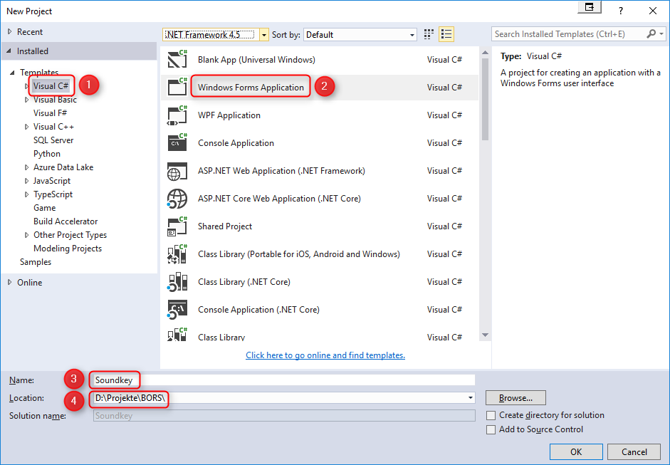

# Soundkey
Tutorial für ein Programm, das Töne abspielt, wenn eine Taste gedrückt wird.

## Der Programmieranfang

Dieses Tutorial sieht vor, dass das Programm in C# geschrieben wird. C# ist eine von vielen Programmiersprachen.

Um in C# zu programmieren verwenden wir einen kostenlosen Editor von Microsoft, nämlich [Visual Studio 2017 Community Edition](https://www.visualstudio.com/downloads). Um an eine kostenlose Lizenz zu kommen brauchst Du einen [Microsoft Live Account](https://login.live.com).

Ein neues Projekt kannst Du auf zwei Arten anlegen:

1. im Menü File / New / Project ...
2. auf der Startseite (sofern angezeigt): New Project ...

Im nächsten Schritt wirst Du mit einer großen Auswahl an Möglichkeiten konfrontiert. Hier gibt es vier Dinge zu erledigen:

1. die Programmiersprache Visual C#
2. ein Projekt mit grafischer Oberfläche vom Typ "Windows Forms Application"
3. einen Namen, den Du selbst auswählen kannst (am besten ohne Leerzeichen und ohne Umlaute)
4. den Ordner, in dem Du Dein Projekt speichern möchtest

Sobald das Projekt erzeugt wurde, siehst Du ein Fenster so ähnlich, wie es später auch mal aussehen wird. Am Anfang hat es noch einen unbrauchbaren Namen und ein unbrauchbares Logo.

## Grafiken erstellen

Zu diesem Zeitpunkt hören wir mit dem Programmieren erst mal auf und schauen uns nach Zeichenprogrammen um, mit denen wir das Logo designen können. Dafür gibt es drei gute Programme, die wir alle drei brauchen können.

1. mit [Inkscape](https://inkscape.org/de/) zeichnen wir verlustfrei, d.h. beliebig skalierbar
2. wer die Grafiken noch nachbearbeiten möchte, findet mit [Paint.NET](https://www.getpaint.net/) eine gute Alternative zu Paint von Microsoft
3. IcoFX kann aus Grafikdateien ein echtes Icon machen. Von IcoFX gibt es noch [eine Freeware Version](http://www.chip.de/downloads/IcoFX-letzte-Freeware-Version_28266149.html), bevor das Programm kostenpflichtig geworden ist.

Das Logo kannst Du dem Fenster zuweisen und auch der Exe-Datei als Bild mitgeben.

## Sounds erstellen

Eine Möglichkeit, Sounds zu erstellen ist Text-to-speech, also das Umwandeln von Text in Sprache. In Windows 10 hat Microsoft schon Sprachen integriert. Mit dem Programm [Balabolka](http://www.cross-plus-a.com/de/balabolka.htm) kannst Du Text in MP3s umwandeln, zum Beispiel das [internationale Buchstabieralphabet](http://www.ib-haertling.de/amateurfunk/Alphabet.pdf).

